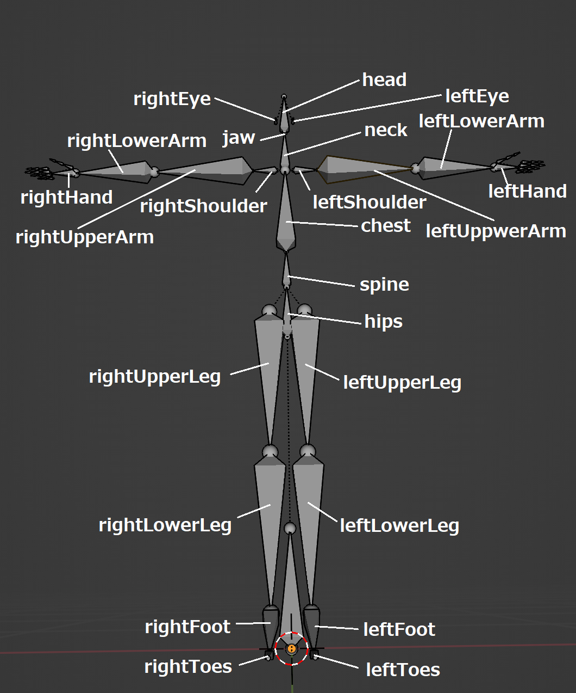

# EXT_skeleton_humanoid

## Contributors

* Takahiro Aoyagi, Mozilla, [@takahirox](https://github.com/takahirox)

## Status

Draft

## Dependencies

Written against the glTF 2.0 spec

## Overview

This extension predefines a default humanoid skeleton structure, allows to
remap glTF animations to any humanoid model that follows the default
skeleton structure, and improves the reusability of humanoid animations.

Humanoid model is one of the popular 3D assets. You will find a lot of humanoid
models in glTF assets download websites.

[The glTF 2.0 core specification supports Linear Blend Skinning.](https://registry.khronos.org/glTF/specs/2.0/glTF-2.0.html#skins)
Humanoid animations, eg: Walk, Run, and Jump, are generally achieved with
skinning. Reusing humanoid animation that is made for a certain humanoid model
to other humanoid models is not easy in glTF because of lack of animation
remapping mechanism.

The difficulty of remapping comes from that different humanoid models may have
different structured skeletons because the glTF 2.0 core does not specify
default humanoid skeleton structure.

Another reason is that animation target in the glTF 2.0 core is tied to a
certain node in the same glTF file and there is no way to target a node
in other glTF files.

Because of these two reasons there is no simple, clear, and common workflow for
applying humanoid animation made for a certain humanoid model to other humanoid
models. Currently even common humanoid animations like Walk need to be made for
each humanoid model. It is very costly. The capability of remapping Humanoid
animation helps to reduce the cost by reusing animation data.

This extension allows easy and efficient humanoid animation remapping across
humanoid models that use the extension. The basic idea consists of

* The extension predefines default humanoid skeleton structure (a series of
bones, their hierarchy, and reference pose)
* The skeletons of humanoid models that use this extension follow the
structure of the default humanoid skeleton
* The extension allows animation channel to specify a target node with
a predefined bone name
* The extension lets animation data represent as relative transform from
the reference pose

The implementations will be able to easily achieve humanoid animation
remapping by

* Loading an animation data
* Loading a humanoid model
* Finding an animation target node by a predefined bone name
* Applying animation calculated from the reference pose

Also, this extension allows to create common humanoid animation library because
animation target is no longer tied to a certain node in the same glTF file.

## Scope

### In scope

* Remap animation among the same or similar structured skeletons.
  * Same or similar structured skeletons allow easy, efficient, and accurate
    animation remapping.

### Out of scope

* Retarget animation among differently structured skeletons.
  * Because it may be costly, complex, or less accurate.
* Add constraints to joints.
  * To avoid complexity. It should be defined in another extension that extends
    this extension.

## Example

This example video shows that the same waving hand keyframe animation data is
applied to two different humanoid models.


The models are originally from 

* https://hub.vroid.com/en/characters/287819523106027526/models/7392039141849953586
* https://hub.vroid.com/en/characters/2843975675147313744/models/5644550979324015604

and edited a bit to follow the extension.

## Predefined skeleton

### Humanoid bone set and hierarchy

Body

|Body parts|Bone name|
|----|----|
|Hips|hips|
|Waist|spine|
|Abdomen|chest|
|Bladebone|upperChest|
|Neck|neck|

Arms

|Body parts|Bone name|
|----|----|
|Left shoulder|leftShoulder|
|Left humerus|leftUpperArm|
|Left forearm|leftLowerArm|
|Left hand|leftHand|
|Right shoulder|rightShoulder|
|Right humerus|rightUpperArm|
|Right forearm|rightLowerArm|
|Right hand|rightHand|

Legs

|Body parts|Bone name|
|----|----|
|Left thigh|leftUpperLeg|
|Left lower thigh|leftLowerLeg|
|Left foot|leftFoot|
|Left toe|leftToes|
|Right thigh|rightUpperLeg|
|Right lower thigh|rightLowerLeg|
|Right foot|rightFoot|
|Right toe|rightToes|

Head

|Body parts|Bone name|
|----|----|
|Left eye|leftEye|
|Right eye|rightEye|
|Head|head|
|Jaw|jaw|

Hands

|Body parts|Bone name|
|----|----|
|Left Thumb - Basal|leftThumbMetacarpal|
|Left Thumb - Middle|leftThumbProximal|
|Left Thumb - Tip|leftThumbDistal|
|Left Index - Basal|leftIndexProximal|
|Left Index - Middle|leftIndexIntermediate|
|Left Index - Tip|leftIndexDistal|
|Left Middle - Basal|leftMiddleProximal|
|Left Middle - Middle|leftMiddleIntermediate|
|Left Middle - Tip|leftMiddleDistal|
|Left Ring - Basal|leftRingProximal|
|Left Ring - Middle|leftRingIntermediate|
|Left Ring - Tip|leftRingDistal|
|Left Little - Basal|leftLittleProximal|
|Left Little - Middle|leftLittleIntermediate|
|Left Little - Tip|leftLittleDistal|
|Right Thumb - Basal|rightThumbMetacarpal|
|Right Thumb - Middle|rightThumbProximal|
|Right Thumb - Tip|rightThumbDistal|
|Right Index - Basal|rightIndexProximal|
|Right Index - Middle|rightIndexIntermediate|
|Right Index - Tip|rightIndexDistal|
|Right Middle - Basal|rightMiddleProximal|
|Right Middle - Middle|rightMiddleIntermediate|
|Right Middle - Tip|rightMiddleDistal|
|Right Ring - Basal|rightRingProximal|
|Right Ring - Middle|rightRingIntermediate|
|Right Ring - Tip|rightRingDistal|
|Right Little - Basal|rightLittleProximal|
|Right Little - Middle|rightLittleIntermediate|
|Right Little - Tip|rightLittleDistal|

Bone hierarchy

```
└─ hips
   ├─ spine
   │  └─ chest
   │     └─ upperChest
   │        ├─ neck
   │        │  └─ head
   │        │     ├─ [left|right]Eye
   │        │     └─ jaw
   │        └─ [left|right]Shoulder
   │           └─ [left|right]UpperArm
   │              └─ [left|right]LowerArm
   │                 └─ [left|right]Hand
   │                    ├─ [left|right]ThumbMetacarpal
   │                    |  └─ [left|right]ThumbProximal
   │                    |     └─ [left|right]ThumbDistal
   │                    └─ [left|right][Index|Middle|Ring|Little]Proximal
   │                       └─ [left|right][Index|Middle|Ring|Little]Intermediate
   │                          └─ [left|right][Index|Middle|Ring|Little]Distal
   └─ [left|right]UpperLeg
      └─ [left|right]LowerLeg
         └─ [left|right]Foot
            └─ [left|right]Toes
```

- Each humanoid bone is optional. If a bone node does not exist in a skeleton,
its parent will be the parent of its children. For example if chest bone does not
exist spine bone node will be parent of upperChest bone node,
like *(parent) spine - upperChest (child)*.
- Intermediate non-humanoid bone nodes are allowed to be between parent and
child bone nodes. For example *(parent) hips - boneFoo - boneBar - spine (child)*
is valid.
- Between parent and child bone nodes other humanoid bone nodes of the same skeleton
**MUST NOT** be. For example *(parent) hips - chest - spine (child)* is invalid.

*Non-normative comment*

This skeleton structure is strongly based on [Unity Mecanim Humanoids](https://blog.unity.com/technology/mecanim-humanoids)
and compatible with [VRM 1.0 humanoid bone set](https://github.com/vrm-c/vrm-specification/blob/master/specification/VRMC_vrm-1.0/humanoid.md).

Because of the compatibility with major humanoid structures, this extension may
allow to reuse their existing ecosystems or workflow.

### Reference pose

The extension adds some restrictions to the default pose to ease the animation
remapping.

* T-Pose
* Facing +Z
* Directs the +Y axis from the parent joint to the child joint
* +X rotation bends the joint like a muscle contracting

*Non-normative comment*

This restrictions are strongly based on [Godot Engine](https://docs.godotengine.org/en/latest/tutorials/assets_pipeline/retargeting_3d_skeletons.html#rest-fixer)

TODO: Finalize the default reference pose restriction [#11](https://github.com/takahirox/EXT_skeleton_humanoid/issues/11)

### Example skeleton

These screenshots shows an example skeleton following the default skeleton structure and reference pose

(Credit: [Blender](https://www.blender.org/) with [VRM addon](https://vrm-addon-for-blender.info/))




## Skeleton definition

The `EXT_skeleton_humanoid` extension in root `glTF` allows to define humanoid
skeletons. `glTF.EXT_skeleton_humanoid.humanoidSkeletons` takes an array of
humanoid skeleton definitions.

`glTF.EXT_skeleton_humanoid.humanoidSkeleton.humanoidBones` defines a map from
the predefined humanoid bone names to `nodes`. The referred `nodes` **MUST** be
[joint nodes](https://registry.khronos.org/glTF/specs/2.0/glTF-2.0.html#skins).

Implementation Note: All the bone nodes of a humanoid skeleton **MAY** belong
to a single `skin` or **MAY** be scattered among multiple `skins`.

`glTF.EXT_skeleton_humanoid.humanoidSkeleton.rootNode` specifies a skeleton
root `node`.

```json
"extensions": {
    "EXT_skeleton_humanoid": {
        "humanoidSkeletons": [
            {
                "rootNode": 0,
                "humanoidBones": {
                    "neck": 1,
                    "leftHand": 2,
                    "rightHand": 3,
                    ...
                },
            },
        ],
    },
},
```

Schema: [glTF.EXT_skeleton_humanoid.schema.json](./schema/glTF.EXT_skeleton_humanoid.schema.json)

### EXT_skeleton_humanoid property

| Property | Type | Description | Requires |
|:------|:------|:------|:------|
| `humanoidSkeletons` | `humanoidSkeleton [1-*]` | An array of skeleton definitions | :white_check_mark: Yes |

### humanoidSkeleton property

| Property | Type | Description | Requires |
|:------|:------|:------|:------|
| `rootNode` | `integer` | `node` index as root node of this skeleton | :white_check_mark: Yes |
| `humanoidBones` | `Object` | A map from the predefined bone names to `node` indices | :white_check_mark: Yes |

## Animation definition

The `EXT_skeleton_humanoid` extension in `animation.channel.target` allows to
specify the target node with a humanoid bone name predefined in the
"Humanoid bone and hierarchy" section.

```json
"animations": [
    {
        "channels": [
            {
                "sampler": 0,
                "target": {
                    "path": "rotation",
                    "extensions": {
                        "EXT_skeleton_humanoid": {
                            "humanoidBoneName": "neck",
                        },
                    },
                }
            },
            {
                "sampler": 1,
                "target": {
                    "path": "rotation"
                    "extensions": {
                        "EXT_skeleton_humanoid": {
                            "humanoidBoneName": "leftHand",
                        },
                    },
                }
            },
            {
                "sampler": 2,
                "target": {
                    "path": "rotation"
                    "extensions": {
                        "EXT_skeleton_humanoid": {
                            "humanoidBoneName": "rightHand",
                        },
                    },
                }
            },
            ...
        ],
    },
],
```

`animation.sampler` reffered by a `animation.channel` that defines this
extension **MUST NOT** be reffered by another `animation.channel` that
does not define this extension.

Schema: [animation.channel.target.EXT_skeleton_humanoid.schema.json](./schema/animation.channel.target.EXT_skeleton_humanoid.schema.json)

### Animation property

| Property | Type | Description | Requires |
|:------|:------|:------|:------|
| `humanoidBoneName` | `string` | A predefined bone name to specify a target node | :white_check_mark: Yes |

## Animation remapping

An animation channel that defines the `EXT_skeleton_humanoid` extension is
expected to be remapped to a humanoid model that defines the
`EXT_skeleton_humanoid` extension.

The implementation can find a target node of a humanoid model by accessing
`EXT_skeleton_humanoid.humanoidSkeleton.humanoidBoneName` as like the following
pseudo code.

```
boneName = animation.channel.target.extensions.EXT_skeleton_humanoid.humanoidBoneName;
targetNodeIndex = glTF.extensions.EXT_skeleton_humanoid.humanoidSkeletons[skeletonIndex].humanoidBones[boneName];
```

`animation.sampler` referred by `animation.channel` whose `target` defines
the `EXT_skeleton_humanoid` extension is expected to hold keyframe animation data
that represents relative transform from target node's reference pose.

The reference poses are specified with
[skin.inverseBindMatrices](https://registry.khronos.org/glTF/specs/2.0/glTF-2.0.html#reference-skin)
so remapped animation can be calculated as like the following pseudo code.

```
bindWorldMatrix = invertMatrix(inverseBindMatrix);
bindLocalMatrix = parentInverseBindMatrix * bindWorldMatrix;
animatedLocalMatrix = bindLocalMatrix * composeMatrix(translation, rotation, scale);
(animatedTranslation, animatedRotation, animatedScale) = decomposeMatrix(animatedLocalMatrix);
```

## Appendix - What is the difference from [VRM](https://vrm.dev/)

*Non-normative extension proposal author comment*

[VRM](https://vrm.dev/) may be a well known humanoid avatar format based on
glTF and it has a glTF humanoid skeleton extension. The readers who know
VRM may wonder why we need another humanoid skeleton extension.

One of the major motivation of proposing the `EXT_skeleton_humanoid`
extension is to free from the limitations of VRM.

VRM has a strong restriction that it allows only one model in a single file.
Its humanoid skeleton extension follows this restriction so that only one
skeleton can be defined in a single file.

It may be a bit too strong limitation and some workflows may not be
compatible with VRM due to the limitation.

The `EXT_skeleton_humanoid` extension does not add such a limitation.
Multiple humanoid models and multiple skeletons can be included in a
single glTF file.

Another disadvantage of VRM is it does not specify keyframe animation
or animation remapping although they are important features for
humanoid models. The `EXT_skeleton_humanoid` extension supports them.

VRM is primarily designed as VR avatar model format and has unique
features and restrictions. I think it is not good to be tied to their
restrictions and their specific ecosystems just for creating a
humanoid model in glTF. I hope we have a humanoid skeleton
multi-vendor extension that is simpler and has less restrictions.

If this extension will be accepted, the VRM humanoid extension
(and other rich humanoid extensions) may extend this extension.
